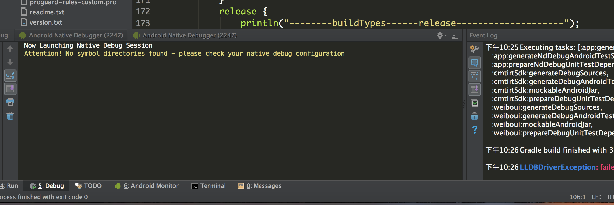

# `Android_Studio_Attach_Debug`耗时太长问题解决
## 背景
在换工作地点之后，我换了工作电脑，用了自己的mac电脑，但是用的并不是那么顺利，其中最影响心情和工作效率就是调试问题，每次用真机调试都要花很长的时间，至少都是7到8分钟，甚至更长，所以就只有用模拟器，虽然调试开始花的时间不多，但是每次都是在调试过程中就莫名的重启了，就这样过了几周，然后这个这个周末实在是忍受不了了，必须得解决这个问题。
## 原因
每次在点击attach按钮的时候，都是出现下图的现象：

于是就找到了突破口了，在窗口中出现了Hybrid等字样，然后在网上搜索，然后大概明白是干什么的了，[Android Studio 1.5+ 中混合调试Native和Java代码](http://blog.csdn.net/th_gsb/article/details/50969634)。这下问题的原因是找到了。相当于是开启了java代码和Native混合调试的功能。
## 解决
    buildTypes {
            debug {
                jniDebuggable false
            }
        }

禁用Jni调试功能就可以。

## 后记
这个问题不是好难，但是特别烦人，在公司问了一些人也不能解决，一直就搁在哪儿没有去管，但是每次需要调试都很不顺利，所以决定自己抽时间解决，所以遇到问题首先要自己思考一下问题的本质，然后找找原因。
