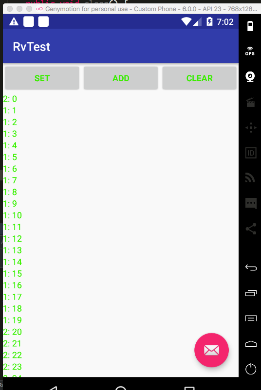

# RecyclerView之java.lang.IndexOutOfBoundsException: Inconsistency detected 异常分析

## 异常完整信息
```
FATAL EXCEPTION: main
Process: com.example.luohao.myapplication, PID: 20222
java.lang.IndexOutOfBoundsException: Inconsistency detected. Invalid view holder adapter positionViewHolder{65cd3ec position=20 id=-1, oldPos=20, pLpos:-1 scrap [attachedScrap] tmpDetached no parent}
at android.support.v7.widget.RecyclerView$Recycler.validateViewHolderForOffsetPosition(RecyclerView.java:5297)
at android.support.v7.widget.RecyclerView$Recycler.tryGetViewHolderForPositionByDeadline(RecyclerView.java:5479)
at android.support.v7.widget.RecyclerView$Recycler.getViewForPosition(RecyclerView.java:5440)
at android.support.v7.widget.RecyclerView$Recycler.getViewForPosition(RecyclerView.java:5436)
at android.support.v7.widget.LinearLayoutManager$LayoutState.next(LinearLayoutManager.java:2224)
at android.support.v7.widget.LinearLayoutManager.layoutChunk(LinearLayoutManager.java:1551)
at android.support.v7.widget.LinearLayoutManager.fill(LinearLayoutManager.java:1511)
at android.support.v7.widget.LinearLayoutManager.onLayoutChildren(LinearLayoutManager.java:595)
at android.support.v7.widget.RecyclerView.dispatchLayoutStep1(RecyclerView.java:3534)
at android.support.v7.widget.RecyclerView.onMeasure(RecyclerView.java:3019)
at android.view.View.measure(View.java:18788)
```

## 异常产生代码
```
public void notifyData(List<RvTestBean> beens) {
    if (mDatas == null) {
        set(beens);
    } else {
        mDatas.clear();
        mDatas.addAll(beens);
        notifyItemChanged(0, beens.size());
//      notifyDataSetChanged();／
    }
}
```

## 产生异常的原因
在进行数据移除和数据增加时，务必要保证`RecyclerView`的`Adapter`中的数据集和移除／添加等操作后的数据集保持一致.

## 异常产生的源码
```
/**
 * Helper method for getViewForPosition.
 * <p>
 * Checks whether a given view holder can be used for the provided position.
 *
 * @param holder ViewHolder
 * @return true if ViewHolder matches the provided position, false otherwise
 */
boolean validateViewHolderForOffsetPosition(ViewHolder holder) {
    // if it is a removed holder, nothing to verify since we cannot ask adapter anymore
    // if it is not removed, verify the type and id.
    if (holder.isRemoved()) {
        if (DEBUG && !mState.isPreLayout()) {
            throw new IllegalStateException("should not receive a removed view unless it"
                    + " is pre layout");
        }
        return mState.isPreLayout();
    }
    if (holder.mPosition < 0 || holder.mPosition >= mAdapter.getItemCount()) {
        throw new IndexOutOfBoundsException("Inconsistency detected. Invalid view holder "
                + "adapter position" + holder);
    }
    if (!mState.isPreLayout()) {
        // don't check type if it is pre-layout.
        final int type = mAdapter.getItemViewType(holder.mPosition);
        if (type != holder.getItemViewType()) {
            return false;
        }
    }
    if (mAdapter.hasStableIds()) {
        return holder.getItemId() == mAdapter.getItemId(holder.mPosition);
    }
    return true;
}
```

## 问题探索
在前面问题的基础之上：

 - 1.首先新添加的数据量大于之前的数据量

 在这种情况下是不会报上面的崩溃，但是页面刷新内容如下；

 

 `1:`这个代表是之前的旧数据；

 `2:`这个代表后面的新数据；

 图片显示结果说明数据没有完全更新，之前的数据还是会显示在上面

 - 2.其次新添加的数据量大于之前的数据量

 这个就直接抛出量上面的异常

 异常抛出的部分代码：
```
if (holder.mPosition < 0 || holder.mPosition >= mAdapter.getItemCount()) {
    throw new IndexOutOfBoundsException("Inconsistency detected. Invalid view holder "
            + "adapter position" + holder);
}
```
 结论：就如同原因说明一样，在`rv`内部会有生成的`ViewHolder`，它们绑定的还是之前数据的位置，如果你新加的数据量小于之前的旧数据量，这里判断的时候从`ViewHolder`的`mPosition`变量中获取的`pos`肯定会循环到大于从`mAdapter.getItemCountc()`中取出的值，所以抛出异常了。

## 解决办法
 - 方法一 （`LinearLayoutManager`为例）

 自己写一个继承`LinearLayoutManager`的包装类，在`onLayoutChildren()`方法里`try-catch`捕获该异常。
 ```
 private class MyLinearLayoutManager extends LinearLayoutManager {

      public MyLinearLayoutManager(Context context) {
          super(context);
      }

      @Override
      public void onLayoutChildren(RecyclerView.Recycler recycler, RecyclerView.State state) {
          try {
              super.onLayoutChildren(recycler, state);
          } catch (IndexOutOfBoundsException e) {
              e.printStackTrace();
          }
      }
  }
 ```
 - 方法二

 见修复代码，删除之前先同步一次：
 ```
 public void notifyData(List<RvTestBean> beens) {
    if (mDatas == null) {
        set(beens);
    } else {
        int preSize = mDatas.size();
        mDatas.clear();
        notifyItemRangeRemoved(0, preSize);
        mDatas.addAll(beens);
        notifyItemChanged(0, beens.size());
//                notifyDataSetChanged();／
    }
}
 ```
 - 方法三

 就是使用万能的`notifyDataSetChanged`来刷新数据。该方法简单，但是失去了动画效果，并且更新数据的性能低。

## 结论
外部数据集同步到内部数据集，使用如下的方法：

 - notifyItemRangeRemoved();
 - notifyItemRangeInserted();
 - notifyItemRangeChanged();
 - notifyDataSetChanged();

 使用除notifyDataSetChanged()这个方法之外的其它方法的时候要特别小心数据一致性问题。

## 参考文章

1.[stackoverflow 1](http://stackoverflow.com/questions/31759171/recyclerview-and-java-lang-indexoutofboundsexception-inconsistency-detected-in)

2.[RecyclerView Bug：IndexOutOfBoundsException: Inconsistency detected. Invalid view holder adapter的解决方案](http://blog.csdn.net/lovexieyuan520/article/details/50537846)

3.[使用RecyclerView遇到的一些问题 Inconsistency detected](http://blog.csdn.net/Singleton1900/article/details/48369239)

4.[当RecyclerView遇到Inconsistency detected崩溃时](http://www.jianshu.com/p/2eca433869e9)
