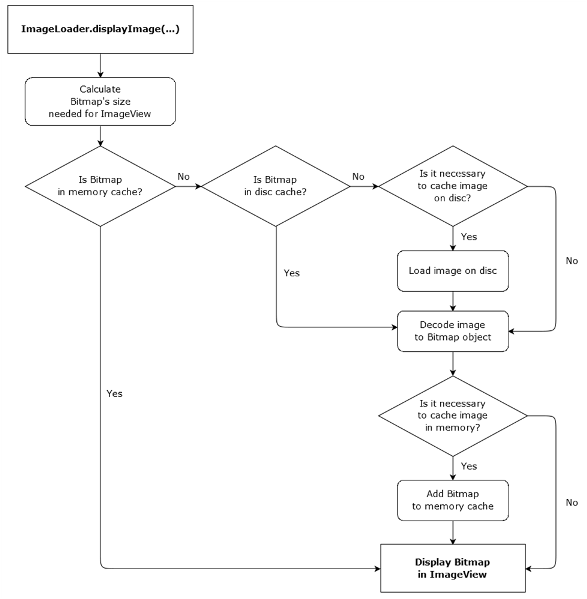
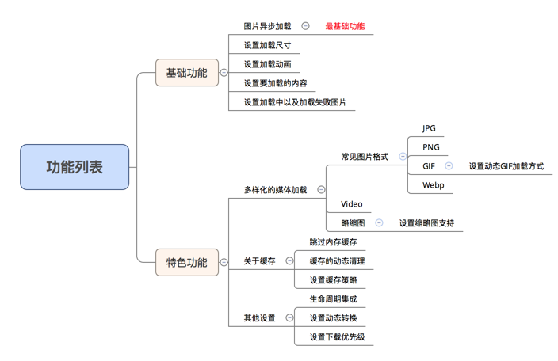

# Android主流图片加载库介绍
## 背景
随着`移动App`内容的多元化，现在移动呈现出来的已经不是再是仅限于传统的文字内容了，更多的是图文并茂，因为能图片比较直观，形象的，快速的告诉阅读者所需要了解的内容。在`Android`端对图片的加载就显得尤为重要了，但是为了不重复的去造轮子，我们经常不会自己去写一些图片加载库，经常都是去第三方开源世界寻找，而现在的主流开源加载库越来越的，我们要怎么去选择适合我们业务的开源库就尤为重要了，接下来我们将从开源库的各个方面进行对比，分别为大家介绍几款比较常用的图片加载库。

## 主流的图片加载库-介绍
- Universal-Image-Loader
- AndroidQuery : ImageLoading
- DroidParts : ImageFetcher
- Fresco
- Glide
- Picasso
- UrlImageViewHelper
- Volley : ImageLoader

### Universal-Image-Loader(uil)
####  1.[github](https://github.com/nostra13/Android-Universal-Image-Loader.git)
#### 2.介绍
`uil` 是一个开源的UI组件，该项目提供了一个可重复使用的图片加载库，可以异步加载，缓存和显示图像。
#### 3.特点
- 多线程的图像加载
- 的可能性的宽调谐对`ImageLoader`的配置（线程池的大小，`HTTP`选项，内
- 存和光盘高速缓存，显示图像，以及其他）
- 的图像的可能性中的缓存存储器和/或设备的文件器系统（或`SD`卡）
- 可以“听”加载过程中
- 可自定义每个显示的图像调用分隔的选项
- `Widget`支持
- `android 1.5`以上支持
- 项目的结构: 每一个图片的加载和显示任务都运行在独立的线程中，除非这个图片缓存在内存中，这种情况下图片会立即显示。如果需要的图片缓存在本地，他们会开启一个独立的线程队列。如果在缓存中没有正确的图片，任务线程会从线程池中获取，因此，快速显示缓存图片时不会有明显的障碍。
- 流程图

  

### Glide
#### 1.[github](https://github.com/bumptech/glide)
#### 2.介绍
实现图片加载
#### 3.特点

从上面可以看出，Glide不仅实现了图片异步加载的功能，还解决了Android中加载图片时需要解决的一些常见问题
